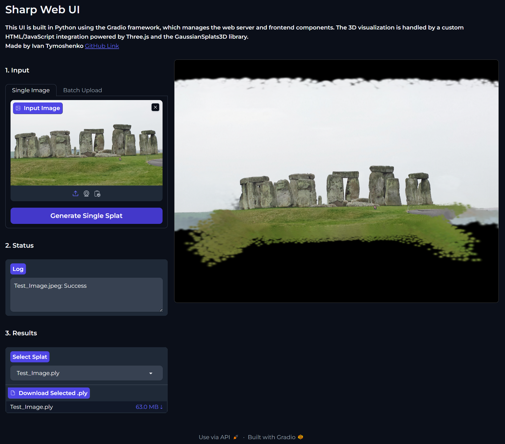

# Sharp Web UI

A lightweight, web-based interface for viewing and creating 3D Gaussian Splats using Apple's SHARP model.
This UI is built in Python using the Gradio framework, which manages the web server and frontend components. The 3D visualization is handled by a custom HTML/JavaScript integration powered by Three.js and the GaussianSplats3D library.





### Prerequisite: Install Apple SHARP First
Before you use this UI, you need the actual engine that does the heavy lifting.
1.  Go to the official **Apple SHARP repository**: [https://github.com/apple/ml-sharp](https://github.com/apple/ml-sharp).
2.  Follow their instructions to clone their repo and set up the environment (usually involving Conda).
3.  **Important:** Remember the name of the environment you created (e.g., `sharp`). You must run this tool *inside* that same environment.

### How to Install & Run
Once you have Apple SHARP installed and working:

1.  Click the green **Code** button above and select **Download ZIP** (or clone this repo).
2.  Unzip the file into a folder on your computer.
3.  Open your terminal (Command Prompt or Terminal).
4.  **Activate the environment** you created for Apple SHARP.
    ```bash
    conda activate sharp
    ```
    *(Or whatever you named your environment)*
5.  Navigate to the folder where you unzipped files:
    ```bash
    cd path/to/sharp-web-ui
    ```
6.  Install the UI dependencies:
    ```bash
    pip install -r requirements.txt
    ```
7.  Run the application:
    ```bash
    python app.py
    ```
8.  Done! Open the local URL shown in your terminal (usually `http://127.0.0.1:7880`). You can always change IP and Port to your likings inside `app.py`

**Tested on Linux**

### Folder Organization
To keep things clean, here is how you should organize your files:
* **Root Folder:** Keep `app.py`, `sharp_runner.py`, and `requirements.txt` here.
* **Inputs:** Create a folder named `inputs` (or whatever you like) and dump your source images there.
* **Outputs:** The tool will automatically generate a folder named "generated_splats" for your .PLY results.

### Features (The Cool Stuff)
* **Batch Processing:** Can process multiple files 1 by 1. For now i put a limit to 50 generations. On the 51st generation it will delete the oldest one automatically. You can change the limit inside `sharp_runner.py` file by changing `MAX_GENERATIONS = 50` to another number.
* **Instant 3D Viewer:** You can view, rotate, and zoom into your 3D splats right in the browser.
* **Simple Interface:** It's just buttons and dropdowns.
* **Local Privacy:** Everything runs on your machine. Your photos don't go to the cloud.

If you find this tool useful, you can support me here:

<a href="https://buymeacoffee.com/mr.ivan.tymoshenko" target="_blank"><strong>Buy me a coffee</strong></a>
